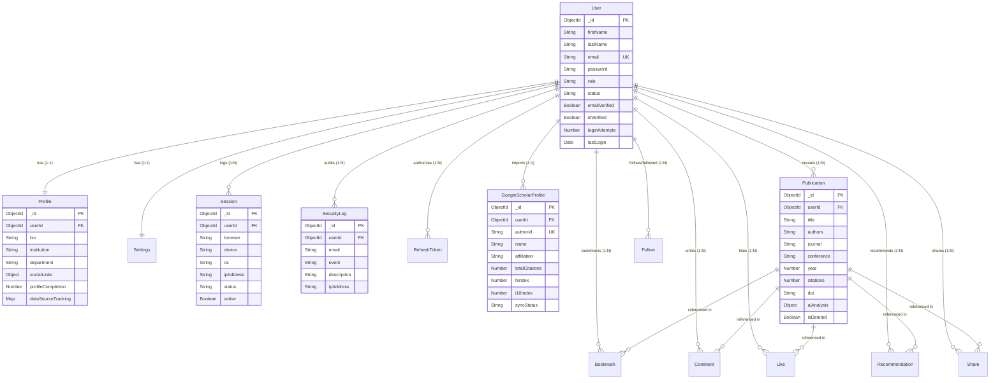

# Research Connect — Database Schema Documentation

This document describes the complete database architecture for the **Research Connect** platform. It outlines the collections, fields, validations, relationships, and indexing strategies used across the database.

---

## 🏛️ General Database Design Principles

To ensure scalability, performance, and compatibility for millions of research records, all collections strictly adhere to the following rules:
1. **Naming Conventions**: Collections use `snake_case` (e.g. `google_scholar_profiles`), and Mongoose models use `PascalCase` (e.g. `GoogleScholarProfile`).
2. **Timestamps**: All schemas have `timestamps: true` enabled, automatically creating `createdAt` and `updatedAt` fields.
3. **Soft Deletion**: Crucial collections support soft deletes through `isDeleted`, `deletedAt`, and `deletedBy` fields.
4. **Audit Support**: Standard collections track authorship through `createdBy`/`updatedBy` or `userId`.
5. **Relationships**: Normalized references (`ObjectId`) are preferred over duplicate embedded records unless optimized for read-heavy caching.
6. **Indexing**: Performance-critical query paths (filtering, sorting, and text searches) are covered by targeted indexes.

---

## 📊 Entity Relationship Diagram (ERD)

---

## 🗄️ Core Collections & Model Specs

### 1. `users` (Model: `User`)
Manages user accounts, authorization roles, and account lock state.

| Field Name | Type | Required | Defaults | Constraints | Description |
| :--- | :--- | :---: | :--- | :--- | :--- |
| `firstName` | String | Yes | — | Trimmed | The user's first name. |
| `lastName` | String | Yes | — | Trimmed | The user's last name. |
| `fullName` | String | No | — | Custom set via pre-save hook | Combined full name. |
| `email` | String | Yes | — | Unique, lowercase, email regex | Email address used for authentication. |
| `password` | String | Yes | — | Min-length: 6, `select: false` | BCrypt hashed password string. |
| `phone` | String | No | `""` | Trimmed | Contact phone number. |
| `role` | String | Yes | `'researcher'` | Enum: `['researcher', 'admin']` | Access authorization role. |
| `researcherType` | String | No | `'academic'` | Enum: `['academic', 'corporate', 'medical', 'non_researcher']` | Sector categorization. |
| `organizationType`| String | No | `'institution'`| Enum: `['institution', 'company', 'hospital', 'organization']` | Org categorization. |
| `status` | String | Yes | `'pending'` | Enum: `['pending', 'active', 'suspended']` | Account activation state. |
| `emailVerified` | Boolean | Yes | `false` | — | True if email registered has been validated. |
| `isVerified` | Boolean | Yes | `false` | — | Sync helper for backwards compatibility. |
| `isActive` | Boolean | Yes | `true` | — | Soft disable switch. |
| `isBlocked` | Boolean | Yes | `false` | — | Set to true when login attempts exceed limit. |
| `loginAttempts` | Number | Yes | `0` | Min: 0 | Current consecutive failed logins. |
| `lastLogin` | Date | No | — | — | Timestamp of last success login. |
| `lastLoginIP` | String | No | — | — | IP address of last success login. |
| `lastLoginDevice` | String | No | — | — | Device details of last success login. |
| `isDeleted` | Boolean | Yes | `false` | — | Soft deletion indicator. |

* **Indexes**: `{ email: 1 }` (Unique), `{ status: 1 }`, `{ isDeleted: 1 }`.

---

### 2. `profiles` (Model: `Profile`)
Stores biography, affiliations, academic links, and details mapped 1:1 to a User.

| Field Name | Type | Required | Defaults | Constraints | Description |
| :--- | :--- | :---: | :--- | :--- | :--- |
| `userId` | ObjectId | Yes | — | Unique, Ref: `User` | Maps profile 1:1 to a user account. |
| `bio` | String | No | `""` | Trimmed, Max: 1000 | Short biography of research interest. |
| `country` | String | No | `""` | Trimmed | Residing country. |
| `institution` | String | No | `""` | Trimmed | University or company name. |
| `department` | String | No | `""` | Trimmed | Academic department. |
| `designation` | String | No | `""` | Trimmed | Academic/Corporate title (e.g. Professor). |
| `socialLinks` | Object | Yes | `{}` | Sub-schema | URLs of external identities. |
| `socialLinks.orcid` | String | No | `""` | Trimmed | ORCID code link. |
| `socialLinks.googleScholar` | String | No | `""` | Trimmed | Google Scholar citations link. |
| `socialLinks.researchGate` | String | No | `""` | Trimmed | ResearchGate link. |
| `socialLinks.linkedin` | String | No | `""` | Trimmed | LinkedIn URL. |
| `socialLinks.website` | String | No | `""` | Trimmed | Personal portfolio homepage URL. |
| `profileCompletion`| Number | Yes | `0` | Min: 0, Max: 100 | Percentage score of profile completions. |
| `dataSourceTracking`| Map | No | `{}` | Mapped keys to source tracking info | Tracks whether fields were modified by the user. |
| `isDeleted` | Boolean | Yes | `false` | — | Soft deletion flag. |

* **Indexes**: `{ userId: 1 }` (Unique), `{ institution: 1 }`, `{ isDeleted: 1 }`.

---

### 3. `google_scholar_profiles` (Model: `GoogleScholarProfile`)
Stores imported academic details synchronized from SerpAPI google_scholar_author engine.

| Field Name | Type | Required | Defaults | Constraints | Description |
| :--- | :--- | :---: | :--- | :--- | :--- |
| `userId` | ObjectId | Yes | — | Ref: `User` | Owner of the imported data. |
| `authorId` | String | Yes | — | Unique, index | 12-char Google Scholar author token. |
| `profileURL` | String | No | `""` | — | Link to Scholar citation profile page. |
| `name` | String | Yes | — | — | Name registered on Google Scholar. |
| `affiliation` | String | No | `""` | — | Affiliation line retrieved. |
| `verifiedEmail` | String | No | `""` | — | Domain verification verified on Google Scholar. |
| `profileImage` | String | No | `""` | — | Link to Google citation profile thumbnail. |
| `researchInterests`| [String] | No | `[]` | — | Interests tags. |
| `totalCitations` | Number | Yes | `0` | Min: 0 | Sum of all publication citations. |
| `hIndex` | Number | Yes | `0` | Min: 0 | Calculated h-index. |
| `i10Index` | Number | Yes | `0` | Min: 0 | Calculated i10-index. |
| `verified` | Boolean | Yes | `false` | — | Verified status flag. |
| `lastImportedAt` | Date | No | — | — | Timestamp of last SerpAPI query success. |
| `syncStatus` | String | Yes | `'pending'` | Enum: `['pending', 'running', 'completed', 'failed']` | Sync queue state. |

* **Indexes**: `{ authorId: 1 }` (Unique), `{ userId: 1 }`, `{ isDeleted: 1 }`.

---

### 4. `publications` (Model: `Publication`)
Contains research items. Imported from Google Scholar or manually created.

| Field Name | Type | Required | Defaults | Constraints | Description |
| :--- | :--- | :---: | :--- | :--- | :--- |
| `userId` | ObjectId | Yes | — | Ref: `User` | User who uploaded or holds the publication. |
| `title` | String | Yes | — | Trimmed | Title of the research item. |
| `authors` | String | No | `""` | — | Multi-author comma-separated string. |
| `publication` | String | No | `""` | — | Conference / Journal name where published. |
| `journal` | String | No | `""` | — | Journal venue. |
| `conference` | String | No | `""` | — | Conference venue. |
| `publisher` | String | No | `""` | — | Publishing house. |
| `year` | Number | No | — | — | Year of publication release. |
| `citations` | Number | Yes | `0` | — | Citation count from source. |
| `citationId` | String | No | `""` | Index | Unique Google Scholar citation ID link. |
| `paperURL` | String | No | `""` | — | Link to the publisher's site. |
| `pdfURL` | String | No | `""` | — | Link to the full-text PDF document. |
| `doi` | String | No | `""` | Trimmed | Digital Object Identifier. |
| `abstract` | String | No | `""` | — | Plain text abstract/summary. |
| `keywords` | [String] | No | `[]` | — | Keyword index tags. |
| `publicationType`| String | Yes | `'Article'` | — | Type classification. |
| `views` | Number | Yes | `0` | — | Platform view counts. |
| `downloads` | Number | Yes | `0` | — | Platform PDF downloads. |
| `readingTime` | Number | Yes | `5` | — | Estimated reading time in minutes. |
| `researchScore` | Number | Yes | `20` | — | Impact score metric. |
| `aiAnalysis` | Object | Yes | `{}` | Sub-schema | Deep AI analysis fields. |
| `aiAnalysis.summary`| String | No | `""` | — | AI generated summarization. |
| `aiAnalysis.researchGap`| String | No | `""` | — | AI identified research limitations. |
| `aiAnalysis.futureWork`| String | No | `""` | — | Proposed directions. |
| `aiAnalysis.noveltyScore`| Number | Yes | `5` | Min: 1, Max: 10 | AI scored originality. |
| `isDeleted` | Boolean | Yes | `false` | — | Soft deletion indicator. |

* **Indexes**: `{ userId: 1 }`, `{ citationId: 1 }`, `{ isDeleted: 1 }`.

---

### 5. `security_logs` (Model: `SecurityLog`)
Logs critical events for security compliance auditing.

| Field Name | Type | Required | Defaults | Constraints | Description |
| :--- | :--- | :---: | :--- | :--- | :--- |
| `userId` | ObjectId | No | — | Ref: `User` | User triggering the security event (if logged in). |
| `email` | String | No | `""` | Trimmed | Email address linked to the event. |
| `event` | String | Yes | — | Enum: `['login_success', 'login_failed', 'otp_sent', 'otp_verified', 'otp_failed', 'password_reset', 'token_refresh_reuse', 'account_blocked', 'logout']` | Event classification tag. |
| `description` | String | Yes | — | — | Detailed explanation of the event. |
| `ipAddress` | String | No | `""` | — | Client IP. |
| `userAgent` | String | No | `""` | — | Browser User-Agent. |
| `device` | String | No | `""` | — | Parsed device classification. |
| `browser` | String | No | `""` | — | Parsed browser client. |
| `os` | String | No | `""` | — | Operating system of client. |

* **Indexes**: `{ userId: 1 }`, `{ email: 1 }`, `{ event: 1 }`, `{ createdAt: -1 }`.

---

### 6. `sessions` (Model: `Session`)
Tracks active browser sessions for authentication validation.

| Field Name | Type | Required | Defaults | Constraints | Description |
| :--- | :--- | :---: | :--- | :--- | :--- |
| `userId` | ObjectId | Yes | — | Ref: `User` | Owner of the session. |
| `browser` | String | No | `'Unknown'` | — | Active browser client. |
| `device` | String | No | `'Unknown'` | — | Device category (e.g. Mobile, Desktop). |
| `os` | String | No | `'Unknown'` | — | Operating system name. |
| `ipAddress` | String | No | `""` | — | Client IP. |
| `location` | String | No | `""` | — | Geo-location (city, country) resolved. |
| `loginTime` | Date | Yes | `Date.now` | — | Initial login timestamp. |
| `logoutTime` | Date | No | — | — | Session end timestamp. |
| `rememberMe` | Boolean | Yes | `false` | — | Keep token active for 30 days switch. |
| `status` | String | Yes | `'active'` | Enum: `['active', 'expired', 'revoked']` | Session condition. |
| `active` | Boolean | Yes | `true` | — | Utility boolean flag. |

* **Indexes**: `{ userId: 1, active: 1 }`, `{ isDeleted: 1 }`.

---

### 7. `bookmarks` (Model: `Bookmark`)
Allows researchers to organize publications in personal folders.

| Field Name | Type | Required | Defaults | Constraints | Description |
| :--- | :--- | :---: | :--- | :--- | :--- |
| `userId` | ObjectId | Yes | — | Ref: `User` | Owner of the bookmark. |
| `publicationId`| ObjectId | Yes | — | Ref: `Publication`| Target publication. |
| `folder` | String | Yes | `'Unsorted'` | Trimmed | Folder label grouping (e.g. "ML Papers"). |
| `notes` | String | No | `""` | — | Private annotation notes. |

---

### 8. `comments` (Model: `Comment`)
Comments section on publications.

| Field Name | Type | Required | Defaults | Constraints | Description |
| :--- | :--- | :---: | :--- | :--- | :--- |
| `publicationId`| ObjectId | Yes | — | Ref: `Publication`| Target publication. |
| `userId` | ObjectId | Yes | — | Ref: `User` | Comment author. |
| `content` | String | Yes | — | Trimmed, Max: 1500 | Comment text content. |
| `parentId` | ObjectId | No | `null` | Ref: `Comment` | Threading parent ID (for replies). |
| `likes` | [ObjectId] | No | `[]` | Ref: `User` array | Researchers who liked the comment. |
| `isDeleted` | Boolean | Yes | `false` | — | Soft deletion indicator. |

---

### 9. `follows` (Model: `Follow`)
Tracks relationships between users on the social feed.

| Field Name | Type | Required | Defaults | Constraints | Description |
| :--- | :--- | :---: | :--- | :--- | :--- |
| `followerId` | ObjectId | Yes | — | Ref: `User` | User who clicked follow. |
| `followingId` | ObjectId | Yes | — | Ref: `User` | User being followed. |

* **Indexes**: `{ followerId: 1, followingId: 1 }` (Unique compound).

---

### 10. `email_otps` (Model: `EmailOtp`)
OTP verification tokens cache with built-in auto-expiration.

| Field Name | Type | Required | Defaults | Constraints | Description |
| :--- | :--- | :---: | :--- | :--- | :--- |
| `email` | String | Yes | — | Lowercase, trimmed | Target address. |
| `otp` | String | Yes | — | 6-digit verification code | Hash string or plain. |
| `purpose` | String | Yes | — | Enum: `['registration', 'login', 'forgot_password']` | Code context. |
| `attempts` | Number | Yes | `0` | Min: 0 | Failure counter. Locked on 5. |
| `expiresAt` | Date | Yes | — | TTL index | Auto deletes 10m after creation. |
| `verified` | Boolean | Yes | `false` | — | Verification success toggle. |

* **Indexes**: `{ expiresAt: 1 }` (TTL), `{ email: 1, purpose: 1 }`.

---

### 11. `contact_requests` (Model: `ContactRequest`)
Tracks support tickets submitted by researchers.

| Field Name | Type | Required | Defaults | Constraints | Description |
| :--- | :--- | :---: | :--- | :--- | :--- |
| `userId` | ObjectId | Yes | — | Ref: `User` | User submitting the request. |
| `name` | String | Yes | — | Trimmed | Full name of the submitter. |
| `email` | String | Yes | — | Lowercase, trimmed | Email address for support communication. |
| `category` | String | Yes | — | Enum: `['General Inquiry', 'Technical Support', 'Account Issue', 'Upload Issue', 'Download Issue', 'Other']` | Type of support request. |
| `subject` | String | Yes | — | Trimmed, Max: 200 | Subject of the request. |
| `message` | String | Yes | — | Trimmed, Max: 5000 | Detailed message content. |
| `attachment` | String | No | `null` | — | URL link to optional file attachment. |
| `status` | String | Yes | `'Pending'` | Enum: `['Pending', 'Resolved']` | Condition of support ticket. |

* **Indexes**: `{ userId: 1, createdAt: -1 }`.

---

### 12. `grievances` (Model: `Grievance`)
Tracks compliance, plagiarism, copyright infringement (DMCA), or abuse reports.

| Field Name | Type | Required | Defaults | Constraints | Description |
| :--- | :--- | :---: | :--- | :--- | :--- |
| `userId` | ObjectId | Yes | — | Ref: `User` | User submitting the grievance. |
| `name` | String | Yes | — | Trimmed | Full name of the complainant. |
| `email` | String | Yes | — | Lowercase, trimmed | Contact email address. |
| `category` | String | Yes | — | Enum: `['Broken Download', 'Upload Failed', 'Duplicate Paper', 'Incorrect Metadata', 'Plagiarism', 'Copyright / DMCA', 'Technical Bug', 'Spam Content', 'Other']` | Grievance type. |
| `paperUrl` | String | No | `null` | Trimmed | Optional URL of the publication being reported. |
| `description` | String | Yes | — | Trimmed, Max: 5000 | Detailed grievance description. |
| `attachment` | String | No | `null` | — | URL link to support documentation or evidence. |
| `status` | String | Yes | `'Pending'` | Enum: `['Pending', 'In Review', 'Resolved']` | Investigation condition. |

* **Indexes**: `{ userId: 1, createdAt: -1 }`.

---

### 13. `feedbacks` (Model: `Feedback`)
Stores user feedback and interface ratings.

| Field Name | Type | Required | Defaults | Constraints | Description |
| :--- | :--- | :---: | :--- | :--- | :--- |
| `userId` | ObjectId | Yes | — | Ref: `User` | Submitting user. |
| `name` | String | No | `""` | Trimmed | Optional submitter name. |
| `email` | String | No | `""` | Lowercase, trimmed | Optional submitter email. |
| `rating` | Number | Yes | — | Min: 1, Max: 5 | Star rating score (1-5). |
| `category` | String | Yes | — | Enum: `['UI / UX', 'Search', 'Upload', 'Download', 'Performance', 'Feature Request', 'General']` | Feedback topic area. |
| `comment` | String | Yes | — | Trimmed, Max: 2000 | Text comments. |

* **Indexes**: `{ userId: 1, createdAt: -1 }`.

