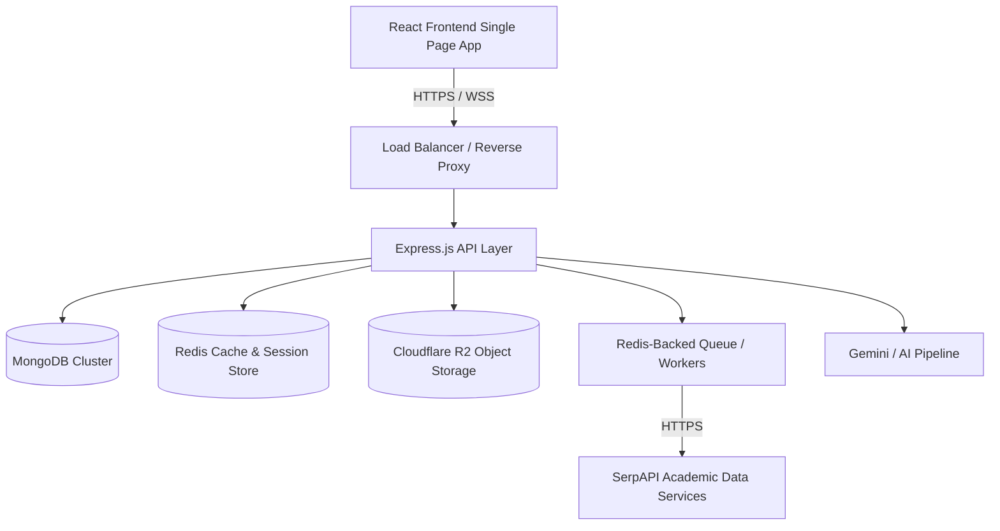
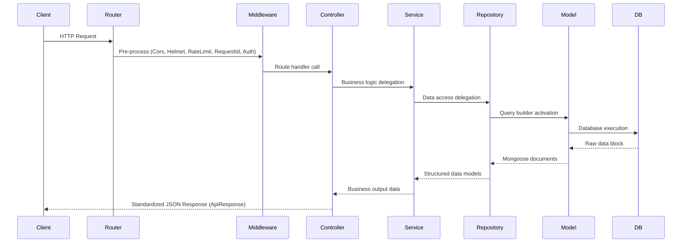
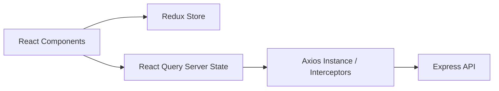
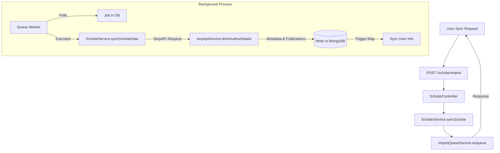

# Research Connect — Architecture Guide

This document outlines the high-level system architecture, design patterns, security controls, and background data synchronization mechanics of **Research Connect**.

---

## 🏛️ Overall System Architecture

Research Connect is built on a modern **MERN (MongoDB, Express, React, Node.js) Stack** and utilizes a decoupled, feature-first design pattern to ensure plug-and-play modularity.

### Core Architecture Components:
- **Primary Database (MongoDB)**: Used for normalized persistent storage of relational models, schemas, user data, publications, and profiles.
- **Cache & Session Store (Redis)**: Implements high-performance session caching, strict session validation checks, brute-force rate limit tracking, and temporary OTP storage with auto-expirations (TTLs).
- **Object Storage (Cloudflare R2)**: S3-compatible object storage used for storing publication PDFs, profile avatars/banners, and research datasets. Uses pre-signed access URLs for private research files and public URLs for static assets.
- **Queue Manager & Background Workers**: Redis-backed queue system for running non-blocking background loops (Email sending, Notification generation, PDF/Image optimizations, and Analytics reports).

---

## 💻 Backend Architecture

The backend follows a strict **Feature-First Layered Architecture** combining MVC, Repository Pattern, and Service Layer patterns.

### Key Layers:
1. **Routing Layer**: Receives HTTP requests, maps them to controllers, and applies validation schemas.
2. **Controller Layer**: Handles API requests, extracts request payloads, delegates to the Service Layer, and sends standard responses. It contains NO business or database queries.
3. **Service Layer**: House of business rules, validation logic, transaction handling, and third-party API orchestrations.
4. **Repository Layer**: Encapsulates all database interactions. Provides an abstraction over Mongoose models so the service layer is decoupled from database-specific operations.
5. **Model Layer**: Defines Mongoose schemas, types, validations, and index boundaries.

---

## 🎨 Frontend Architecture

The React frontend utilizes **Vite** for fast builds, **Redux Toolkit** for sync state management, **React Query (TanStack Query)** for async server state caching, **Axios** for interceptor-based api calls, and **Tailwind CSS** for UI layouts.

### State Management Separation:
- **Client Sync State (Redux)**: Global settings like dark mode themes, navigation menus, notifications, authentication tokens, and user metadata.
- **Server Async State (React Query)**: Caches queries, handles pre-fetching, invalidates state on mutations, and reduces round-trip network overhead.

---

## ⚙️ Google Scholar Sync & Queue Architecture

To prevent API timeouts and manage SerpAPI request limits, importing Google Scholar profiles is implemented as an asynchronous queue process.

### Synchronization Steps & Mechanics:
1. **Enqueue**: The researcher triggers an import by providing a Google Scholar URL. The request is pushed to an in-memory queue and recorded in the `Import` and `ImportLog` collections.
2. **SerpAPI Execution**: The worker queries SerpAPI (`google_scholar_author` engine) using the author identifier.
3. **Writing Portfolios**:
   - **Profile Stats**: Total Citations, h-index, i10-index, interests, and profile image are written to `GoogleScholarProfile`.
   - **Publications**: Each publication in the author's listing is parsed and stored in the `Publication` collection.
   - **Metrics & Graphs**: Graph relationships (`CoAuthor` and `CitationGraph`) are mapped.
4. **Data Source Tracking**:
   - To prevent subsequent automated sync operations from overwriting profile adjustments manually entered by the user, the platform uses `dataSourceTracking` (a schema Map inside `Profile`).
   - Fields marked as `userModified: true` are preserved, while other details (e.g. total citations count) are updated automatically.

---

## 📰 Social Feed & Recommendations Architecture

The Feed module aggregates publications, user activity, and AI-generated indicators to construct real-time research feeds.

### Feed Modes:
1. **Personal Feed (`/feed`)**: Uses MongoDB aggregation pipelines to retrieve publications from researchers the user is following, filtered for soft deletes and formatted.
2. **Trending Feed (`/feed/trending`)**: Calculates a popularity score based on publication citation rates, bookmark volume, and like activity.
3. **Recommended Feed (`/feed/recommended`)**: Recommends items by matching user research interests (profile tags) with publication keywords using case-insensitive regex patterns.

---

## 🔒 Security Architecture Details

The Authentication module implements industry standard practices to protect research data and prevent unauthorized breaches:

1. **HttpOnly Secure Cookies**: Refresh tokens are stored strictly in client cookies using the `HttpOnly`, `Secure` (production), and `SameSite=Lax` headers. This shields the tokens from malicious cross-site scripting (XSS) extractions.
2. **Refresh Token Rotation (RTR)**: Every time a refresh token is exchanged, the server invalidates it, issues a new token, and saves it. If a previously exchanged token is presented:
   - **Breach Detection**: The backend flags a potential replay attack, revokes all sessions/refresh tokens for that user immediately, and logs a security audit event.
3. **Double Verification OTP (2FA)**: High-security endpoints (Registration completion, Account logins, Password resets) trigger a 6-digit verification code with a strict **10-minute expiration** and a maximum threshold of **5 failed attempts** before locking.
4. **Brute Force Defense**: Login endpoints track consecutive failures (`loginAttempts`). Upon exceeding 5 attempts, the account is suspended (`isBlocked: true`), a Winston critical security event is dispatched, and a security email alert is sent to the researcher.
5. **Auditing (`SecurityLog`)**: All critical events (login success/failure, OTP verify, token rotation reuse, password resets) are recorded in `SecurityLog` with details of IP Address, User Agent, OS, and Browser.
